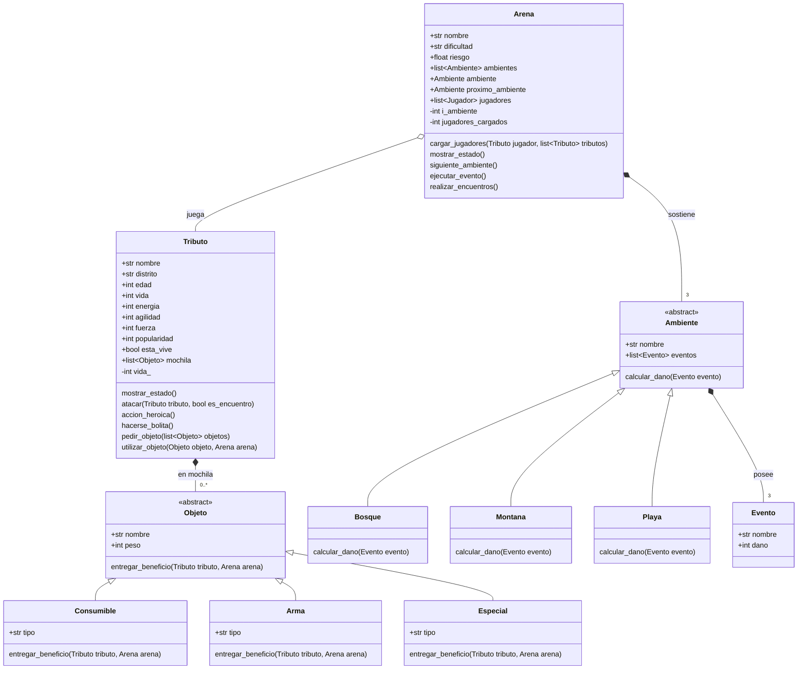

[![](https://mermaid.ink/img/eyJjb2RlIjoiY2xhc3NEaWFncmFtXG4gICAgT2JqZXRvIDx8LS0gQ29uc3VtaWJsZVxuICAgIE9iamV0byA8fC0tIEFybWFcbiAgICBPYmpldG8gPHwtLSBFc3BlY2lhbFxuICAgIEFtYmllbnRlIDx8LS0gQm9zcXVlXG4gICAgQW1iaWVudGUgPHwtLSBNb250YW5hXG4gICAgQW1iaWVudGUgPHwtLSBQbGF5YVxuXG4gICAgQXJlbmEgKi0tIFwiM1wiIEFtYmllbnRlIDogc29zdGllbmVcbiAgICBBbWJpZW50ZSAqLS0gXCIzXCIgRXZlbnRvIDogcG9zZWVcbiAgICBBcmVuYSBvLS0gVHJpYnV0byA6IGp1ZWdhXG4gICAgVHJpYnV0byAqLS0gXCIwLi4qXCIgT2JqZXRvIDogZW4gbW9jaGlsYVxuXG4gICAgPDxhYnN0cmFjdD4-IEFtYmllbnRlXG4gICAgPDxhYnN0cmFjdD4-IE9iamV0b1xuICAgIGNsYXNzIEFyZW5hIHtcbiAgICAgICAgK3N0ciBub21icmVcbiAgICAgICAgK3N0ciBkaWZpY3VsdGFkXG4gICAgICAgICtmbG9hdCByaWVzZ29cbiAgICAgICAgK2xpc3R-QW1iaWVudGV-IGFtYmllbnRlc1xuICAgICAgICArQW1iaWVudGUgYW1iaWVudGVcbiAgICAgICAgK0FtYmllbnRlIHByb3hpbW9fYW1iaWVudGVcbiAgICAgICAgK2xpc3R-SnVnYWRvcn4ganVnYWRvcmVzXG5cbiAgICAgICAgLWludCBpX2FtYmllbnRlXG4gICAgICAgIC1pbnQganVnYWRvcmVzX2NhcmdhZG9zXG5cbiAgICAgICAgY2FyZ2FyX2p1Z2Fkb3JlcyhUcmlidXRvIGp1Z2Fkb3IsIGxpc3R-VHJpYnV0b34gdHJpYnV0b3MpXG4gICAgICAgIG1vc3RyYXJfZXN0YWRvKClcbiAgICAgICAgc2lndWllbnRlX2FtYmllbnRlKClcbiAgICAgICAgZWplY3V0YXJfZXZlbnRvKClcbiAgICAgICAgcmVhbGl6YXJfZW5jdWVudHJvcygpXG4gICAgfVxuXG4gICAgY2xhc3MgQW1iaWVudGUge1xuICAgICAgICArc3RyIG5vbWJyZVxuICAgICAgICArbGlzdH5FdmVudG9-IGV2ZW50b3NcbiAgICAgICAgY2FsY3VsYXJfZGFubyhFdmVudG8gZXZlbnRvKVxuICAgIH1cblxuICAgIEJvc3F1ZSA6IGNhbGN1bGFyX2Rhbm8oRXZlbnRvIGV2ZW50bylcbiAgICBNb250YW5hIDogY2FsY3VsYXJfZGFubyhFdmVudG8gZXZlbnRvKVxuICAgIFBsYXlhIDogY2FsY3VsYXJfZGFubyhFdmVudG8gZXZlbnRvKVxuXG4gICAgY2xhc3MgRXZlbnRvIHtcbiAgICAgICAgK3N0ciBub21icmVcbiAgICAgICAgK2ludCBkYW5vXG4gICAgfVxuXG5cbiAgICBjbGFzcyBUcmlidXRvIHtcbiAgICAgICAgK3N0ciBub21icmVcbiAgICAgICAgK3N0ciBkaXN0cml0b1xuICAgICAgICAraW50IGVkYWRcbiAgICAgICAgK2ludCB2aWRhXG4gICAgICAgICtpbnQgZW5lcmdpYVxuICAgICAgICAraW50IGFnaWxpZGFkXG4gICAgICAgICtpbnQgZnVlcnphXG4gICAgICAgICtpbnQgcG9wdWxhcmlkYWRcbiAgICAgICAgK2Jvb2wgZXN0YV92aXZlXG4gICAgICAgICtsaXN0fk9iamV0b34gbW9jaGlsYVxuICAgICAgICAtaW50IHZpZGFfXG5cbiAgICAgICAgbW9zdHJhcl9lc3RhZG8oKVxuICAgICAgICBcbiAgICAgICAgYXRhY2FyKFRyaWJ1dG8gdHJpYnV0bywgYm9vbCBlc19lbmN1ZW50cm8pXG4gICAgICAgIGFjY2lvbl9oZXJvaWNhKClcbiAgICAgICAgaGFjZXJzZV9ib2xpdGEoKVxuXG4gICAgICAgIHBlZGlyX29iamV0byhsaXN0fk9iamV0b34gb2JqZXRvcylcbiAgICAgICAgdXRpbGl6YXJfb2JqZXRvKE9iamV0byBvYmpldG8sIEFyZW5hIGFyZW5hKVxuICAgIH1cblxuICAgIGNsYXNzIE9iamV0byB7XG4gICAgICAgICtzdHIgbm9tYnJlXG4gICAgICAgICtpbnQgcGVzb1xuXG4gICAgICAgIGVudHJlZ2FyX2JlbmVmaWNpbyhUcmlidXRvIHRyaWJ1dG8sIEFyZW5hIGFyZW5hKVxuICAgIH1cblxuICAgIENvbnN1bWlibGUgOiBlbnRyZWdhcl9iZW5lZmljaW8oVHJpYnV0byB0cmlidXRvLCBBcmVuYSBhcmVuYSlcbiAgICBDb25zdW1pYmxlIDogK3N0ciB0aXBvXG4gICAgQXJtYSA6IGVudHJlZ2FyX2JlbmVmaWNpbyhUcmlidXRvIHRyaWJ1dG8sIEFyZW5hIGFyZW5hKVxuICAgIEFybWEgOiArc3RyIHRpcG9cbiAgICBFc3BlY2lhbCA6IGVudHJlZ2FyX2JlbmVmaWNpbyhUcmlidXRvIHRyaWJ1dG8sIEFyZW5hIGFyZW5hKVxuICAgIEVzcGVjaWFsIDogK3N0ciB0aXBvXG5cbiAgICAiLCJtZXJtYWlkIjp7InRoZW1lIjoiZGVmYXVsdCJ9LCJ1cGRhdGVFZGl0b3IiOmZhbHNlLCJhdXRvU3luYyI6dHJ1ZSwidXBkYXRlRGlhZ3JhbSI6ZmFsc2V9)](https://mermaid-js.github.io/mermaid-live-editor/edit#eyJjb2RlIjoiY2xhc3NEaWFncmFtXG4gICAgT2JqZXRvIDx8LS0gQ29uc3VtaWJsZVxuICAgIE9iamV0byA8fC0tIEFybWFcbiAgICBPYmpldG8gPHwtLSBFc3BlY2lhbFxuICAgIEFtYmllbnRlIDx8LS0gQm9zcXVlXG4gICAgQW1iaWVudGUgPHwtLSBNb250YW5hXG4gICAgQW1iaWVudGUgPHwtLSBQbGF5YVxuXG4gICAgQXJlbmEgKi0tIFwiM1wiIEFtYmllbnRlIDogc29zdGllbmVcbiAgICBBbWJpZW50ZSAqLS0gXCIzXCIgRXZlbnRvIDogcG9zZWVcbiAgICBBcmVuYSBvLS0gVHJpYnV0byA6IGp1ZWdhXG4gICAgVHJpYnV0byAqLS0gXCIwLi4qXCIgT2JqZXRvIDogZW4gbW9jaGlsYVxuXG4gICAgPDxhYnN0cmFjdD4-IEFtYmllbnRlXG4gICAgPDxhYnN0cmFjdD4-IE9iamV0b1xuICAgIGNsYXNzIEFyZW5hIHtcbiAgICAgICAgK3N0ciBub21icmVcbiAgICAgICAgK3N0ciBkaWZpY3VsdGFkXG4gICAgICAgICtmbG9hdCByaWVzZ29cbiAgICAgICAgK2xpc3R-QW1iaWVudGV-IGFtYmllbnRlc1xuICAgICAgICArQW1iaWVudGUgYW1iaWVudGVcbiAgICAgICAgK0FtYmllbnRlIHByb3hpbW9fYW1iaWVudGVcbiAgICAgICAgK2xpc3R-SnVnYWRvcn4ganVnYWRvcmVzXG5cbiAgICAgICAgLWludCBpX2FtYmllbnRlXG4gICAgICAgIC1pbnQganVnYWRvcmVzX2NhcmdhZG9zXG5cbiAgICAgICAgY2FyZ2FyX2p1Z2Fkb3JlcyhUcmlidXRvIGp1Z2Fkb3IsIGxpc3R-VHJpYnV0b34gdHJpYnV0b3MpXG4gICAgICAgIG1vc3RyYXJfZXN0YWRvKClcbiAgICAgICAgc2lndWllbnRlX2FtYmllbnRlKClcbiAgICAgICAgZWplY3V0YXJfZXZlbnRvKClcbiAgICAgICAgcmVhbGl6YXJfZW5jdWVudHJvcygpXG4gICAgfVxuXG4gICAgY2xhc3MgQW1iaWVudGUge1xuICAgICAgICArc3RyIG5vbWJyZVxuICAgICAgICArbGlzdH5FdmVudG9-IGV2ZW50b3NcbiAgICAgICAgY2FsY3VsYXJfZGFubyhFdmVudG8gZXZlbnRvKVxuICAgIH1cblxuICAgIEJvc3F1ZSA6IGNhbGN1bGFyX2Rhbm8oRXZlbnRvIGV2ZW50bylcbiAgICBNb250YW5hIDogY2FsY3VsYXJfZGFubyhFdmVudG8gZXZlbnRvKVxuICAgIFBsYXlhIDogY2FsY3VsYXJfZGFubyhFdmVudG8gZXZlbnRvKVxuXG4gICAgY2xhc3MgRXZlbnRvIHtcbiAgICAgICAgK3N0ciBub21icmVcbiAgICAgICAgK2ludCBkYW5vXG4gICAgfVxuXG5cbiAgICBjbGFzcyBUcmlidXRvIHtcbiAgICAgICAgK3N0ciBub21icmVcbiAgICAgICAgK3N0ciBkaXN0cml0b1xuICAgICAgICAraW50IGVkYWRcbiAgICAgICAgK2ludCB2aWRhXG4gICAgICAgICtpbnQgZW5lcmdpYVxuICAgICAgICAraW50IGFnaWxpZGFkXG4gICAgICAgICtpbnQgZnVlcnphXG4gICAgICAgICtpbnQgcG9wdWxhcmlkYWRcbiAgICAgICAgK2Jvb2wgZXN0YV92aXZlXG4gICAgICAgICtsaXN0fk9iamV0b34gbW9jaGlsYVxuICAgICAgICAtaW50IHZpZGFfXG5cbiAgICAgICAgbW9zdHJhcl9lc3RhZG8oKVxuICAgICAgICBcbiAgICAgICAgYXRhY2FyKFRyaWJ1dG8gdHJpYnV0bywgYm9vbCBlc19lbmN1ZW50cm8pXG4gICAgICAgIGFjY2lvbl9oZXJvaWNhKClcbiAgICAgICAgaGFjZXJzZV9ib2xpdGEoKVxuXG4gICAgICAgIHBlZGlyX29iamV0byhsaXN0fk9iamV0b34gb2JqZXRvcylcbiAgICAgICAgdXRpbGl6YXJfb2JqZXRvKE9iamV0byBvYmpldG8sIEFyZW5hIGFyZW5hKVxuICAgIH1cblxuICAgIGNsYXNzIE9iamV0byB7XG4gICAgICAgICtzdHIgbm9tYnJlXG4gICAgICAgICtpbnQgcGVzb1xuXG4gICAgICAgIGVudHJlZ2FyX2JlbmVmaWNpbyhUcmlidXRvIHRyaWJ1dG8sIEFyZW5hIGFyZW5hKVxuICAgIH1cblxuICAgIENvbnN1bWlibGUgOiBlbnRyZWdhcl9iZW5lZmljaW8oVHJpYnV0byB0cmlidXRvLCBBcmVuYSBhcmVuYSlcbiAgICBDb25zdW1pYmxlIDogK3N0ciB0aXBvXG4gICAgQXJtYSA6IGVudHJlZ2FyX2JlbmVmaWNpbyhUcmlidXRvIHRyaWJ1dG8sIEFyZW5hIGFyZW5hKVxuICAgIEFybWEgOiArc3RyIHRpcG9cbiAgICBFc3BlY2lhbCA6IGVudHJlZ2FyX2JlbmVmaWNpbyhUcmlidXRvIHRyaWJ1dG8sIEFyZW5hIGFyZW5hKVxuICAgIEVzcGVjaWFsIDogK3N0ciB0aXBvXG5cbiAgICAiLCJtZXJtYWlkIjoie1xuICBcInRoZW1lXCI6IFwiZGVmYXVsdFwiXG59IiwidXBkYXRlRWRpdG9yIjpmYWxzZSwiYXV0b1N5bmMiOnRydWUsInVwZGF0ZURpYWdyYW0iOmZhbHNlfQ)

